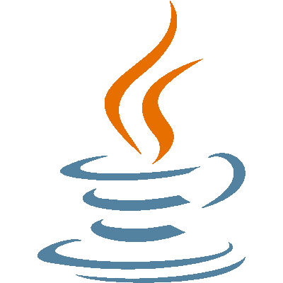

# Hi there, I'm Martin 👋

## Engineering student in Data Science and Artificial Intelligence

- :mortar_board: I’m currently studying at [ESIEE Paris](https://www.esiee.fr/)
- :computer: I’m currently learning Data Science and Artificial Intelligence

### Connect with me :

[][linkedin]

 
 

## Languages and Tools

### Languages

[][python]
[][java]
[][R]
[][html]
[][css]
[][js]
[][bash]
 

## Engineering Tools

[][docker]
[][flask]
[][mysql]
 

## Others Dev Tools

[][atom]
[][git]
[][gitlab]
[][github]
[][visualstudiocode]

 
 

---

[linkedin]: https://www.linkedin.com/in/martin-moritz-1944731b1/
[python]: https://en.wikipedia.org/wiki/Python_(programming_language)
[java]: https://en.wikipedia.org/wiki/Java
[R]: https://en.wikipedia.org/wiki/R_(programming_language)
[html]: https://en.wikipedia.org/wiki/HTML
[css]: https://en.wikipedia.org/wiki/CSS
[js]: https://en.wikipedia.org/wiki/JavaScript
[bash]: https://en.wikipedia.org/wiki/Bash_(Unix_shell)
[flask]: https://en.wikipedia.org/wiki/Flask_(web_framework)
[atom]: https://en.wikipedia.org/wiki/Atom_(text_editor)
[git]: https://en.wikipedia.org/wiki/Git
[gitlab]: https://en.wikipedia.org/wiki/GitLab
[github]: https://en.wikipedia.org/wiki/GitHub
[docker]: https://en.wikipedia.org/wiki/Docker_(software)
[mysql]: https://en.wikipedia.org/wiki/MySQL
[visualstudiocode]: https://en.wikipedia.org/wiki/Visual_Studio_Code
